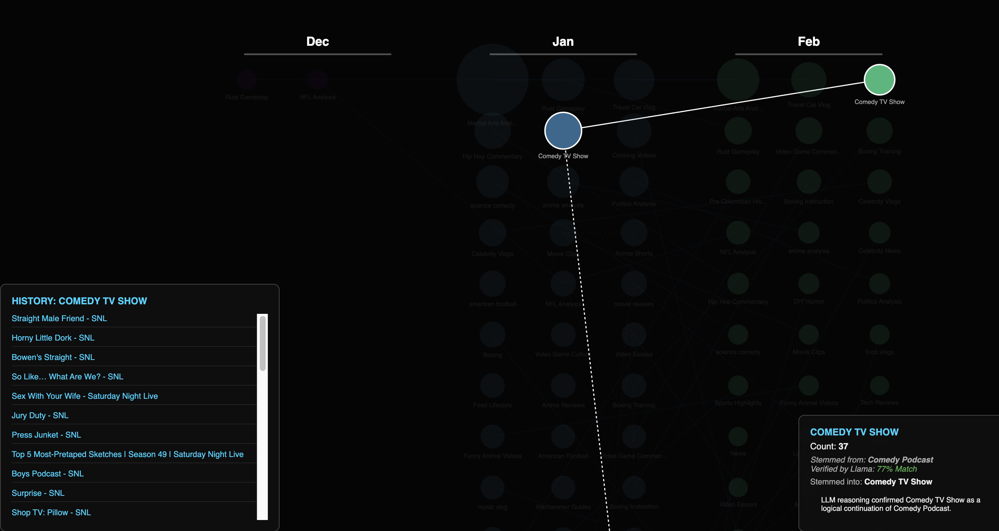

# YouTube Content Lineage Visualizer

This project analyzes YouTube watch history to identify evolving interests. It uses a local Ollama instance to classify content and a D3.js frontend to visualize the connections between those interests over time.




## File Descriptions

* **`get_video_metadata.py`**: Reads your raw watch history and fetches titles, descriptions, and channel information for each video ID. This metadata provides the context necessary for the LLM to make accurate classifications.
* **`llm_classify.py`**: Connects to a local Ollama API. It sends the video metadata and "parent content" (channel/context) to Llama 3.1 to derive a high-level `llm_category` for every entry.
* **`generate_graph_ollama.py`**: Processes the classified metadata. It groups videos by month, generates embeddings for each category, and uses cosine similarity to identify which topics persist or branch between time periods. Output is saved to `data/graph_data.json`.
* **`process_watch_history.py`**: This pulls video ids and titles from the `data/watch-history.json` file.
* **`index.html`**: The frontend visualization. It reads the graph JSON and renders an interactive temporal grid using D3.js.

**start the server with `python3 -m http.server 8000`**

## Data Acquisition

### 1. Google Takeout (Watch History)
1. Go to [Google Takeout](https://takeout.google.com/).
2. Select **only** "YouTube and YouTube Music".
3. Under "All YouTube data included," select **only** "history".
4. Set the format for History to **JSON**.
5. Once downloaded, place `watch-history.json` into the `data/` directory.

### 2. YouTube API Key
1. Create a project in the [Google Cloud Console](https://console.cloud.google.com/).
2. Enable the **YouTube Data API v3**.
3. Create an **API Key** under "Credentials".
4. Add this key to your `.env` file.


## Logic Overview

### Classification
The system uses **Llama 3.1** via Ollama to perform zero-shot classification. By analyzing both the specific video title and the broader channel context (parent content), the LLM assigns a "canonical" category that remains consistent across different months of data.

### Lineage Mapping
The lineage is determined by comparing the mathematical similarity (embeddings) of categories from one month to the next. If a category in Month B is significantly similar to a category in Month A, a "link" is drawn, representing a continuing interest lane.

## Setup & Usage

1. **Environment**:
   ```bash
   python -m venv .venv
   source .venv/bin/activate
   pip install -r requirements.txt


See `assets/.env_example` for a sample of how you might set up your .env file 